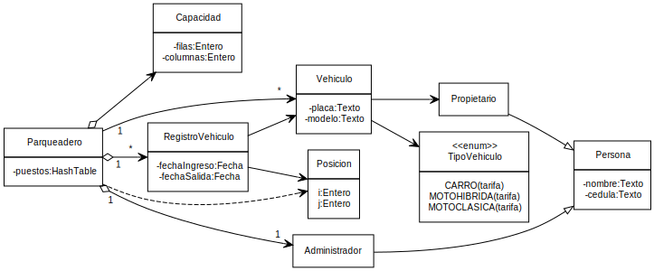
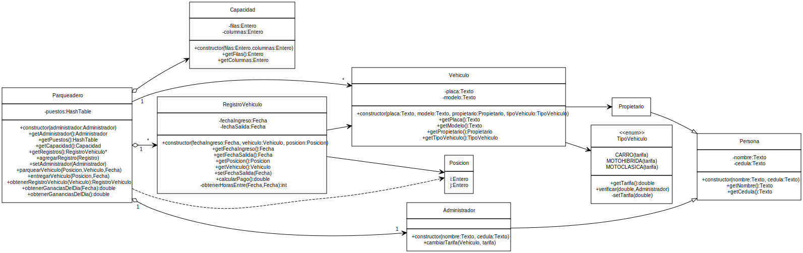

<h1 style="color: gray">Proyecto final programación</h1>

<h5 style="color: gray">Cristhian Daniel Saavedra Guampe Samuel Saith Calle Santa
 
Programa de Ingeniería de Sistemas y Computación 
Facultad de Ingeniería
</h5>

<b>

Administración Parqueadero 
</b>

---

Se desea desarrollar una aplicación para la administración eficiente de un parqueadero:

El parqueadero cuenta con un número n de puestos, cada uno identificado por una posición única (i, j). Cada puesto puede estar ocupado por un vehículo, que puede ser de tipo moto
(clásica o híbrida) o carro, y debe tener una placa, un modelo y un propietario registrado en el
sistema.

Para las motos, se debe registrar también su velocidad máxima, ya que el parqueadero es frecuentado por compradores de motos usadas interesados en conocer este dato. 

---

Un vehículo solo puede ocupar un puesto a la vez, por lo que se debe verificar la disponibilidad del puesto antes de ubicar un vehículo en él.

El sistema debe llevar un registro completo de todos los vehículos que han parqueado en el establecimiento, incluyendo información sobre el puesto ocupado y el momento de ingreso.

Además, debe permitir la identificación del propietario de un vehículo ubicado en un puesto
dado y llevar un registro de todos los ingresos al parqueadero, registrando el puesto ocupado
y el vehículo ubicado en el mismo.

---

Sistema que permita :

- Creación de parqueadero con número de puestos
- Cada puesto debe tener una posición (i, j) y puede estar ocupado por un vehículo
- El vehículo puede ser de tipo moto(clásica o híbrida) o carro y debe tener como atributos una placa, modelo y un propietario
- Si es de tipo moto se debe registrar su velocidad maxima
- Verificar si un puesto está ocupado (por un vehículo) o si esta libre
- Debe llevar un registro de todos los vehículos que han parqueado en el parqueadero
- Identificar al propietario de un vehículo ubicado en un puesto dado

---

- LLevar un registro de todos los ingresos al parqueadero incluyendo el puesto ocupado y el vehículo ubicado en el mismo
- Un puesto ocupado solo por un vehículo en un momento dado
- Para que el vehículo ocupe el puesto, este debe estar vacío
- Establecer una tarifa por hora de uso del parqueadero según el tipo de vehículo
- Calcular el costo total de estacionamiento de un vehículo basado en el tiempo de uso y su respectiva tarifa
- El administrador podrá configurar las tarifas para cada tipo de vehículo
- Generar reporte diario y mensual del dinero recaudado
- Reporte diario incluye total dinero recaudado separado por tipo de vehículo

---

- **Parqueadero**:
  - Puestos: HashTable
  - numeroFilas: Entero
  - numeroColumnas: Entero

- **Registro Vehículo**:
  - fechaIngreso: Fecha
  - fechaSalida : Fecha

- **Posicion**:
  - i: Entero
  - j: Entero

---

- **Propietario**:
  - nombre : Texto
  - cedula : Texto
  
- **Administrador**:
  - nombre: Texto
  - cedula : Texto

- **Vehiculo**:
  - velocidadMax : Real
  - placa: Texto
  - modelo: Texto

  

---

- **Tipo Vehiculo**:
  - MOTOHIBRIDA
  - MOTOCLASICA
  - CARRO

---

---

- **Parqueadero**
  - Asignar número de puestos
  - Obtener administrador del parqueadero
  - Obtener puestos
  - Obtener registro de vehículos
  - Obtener vehículos
  - Generar reporte diario desglosado
  - Generar reporte mensual

- **Administrador**
  - Cambiar el valor de las tarifas por hora por tipo de vehículo

---

- **RegistroVehiculo**
  - Obtener la fecha de ingreso del vehículo
  - Obtener la fecha de salida del vehículo
  - Obtener puesto ocupado por ese vehículo
  - Calcular tiempo de estancia

- **Persona** (**Administrador**, **Propietario**)
  - Obtener nombre
  - Obtener cédula
  
---

- **Vehiculo**
  - Obtener placa del vehículo
  - Obtener modelo del vehículo
  - Obtener velocidad maxima del vehículo
  - Obtener tipo de vehículo
  - Obtener propietario del vehículo

---

---

- Almacenar datos de prueba
- Recuperar los datos de prueba
- Verificar que los datos almacenados coinciden con los datos recuperados

---

Clase: **Parqueadero**

| Prueba                                | Entrada de datos                                          | Salida (Resultado)                                                                                  |
|---------------------------------------|-----------------------------------------------------------|-----------------------------------------------------------------------------------------------------|
| Posición no valida | Se crea el objeto parqueadero con su administrador("Juan", "246060089") y capacidad (5, 2), se crean las 10 posiciones/puestos (filas de 1-5 y columnas de 1-2), se le asigna un propietario a 10 vehículos diferentes y seguido se les aplica el método parquear a cada vehículo en un puesto diferente, se crea una posicion que no existe(2, 5) y un vehiculo("aaaaaaa","si","25000",TipoVehiculo.CARRO,propietario) se intenta parquear ese vehiculo en la posicion inexistente | Error, no se puede parquear un vehículo en una posición que no existe |
| Parquear dos vehiculos | Se crean dos posiciones: a(1, 1) y b(1,2) y dos vehículos moto("BDC45444","suzuki","25000",TipoVehiculo.MOTO_CLASICA,propietario), carro(("AWK173","Audi","25000",TipoVehiculo.CARRO,propietario)) se parquea el objeto carro en la posición a y el objeto moto en la posición b | Se obtiene que en la posición a esta el vehículo carro y en la posición b se encuentra el vehículo moto |
| Parquear en puesto ocupado |   Se crean una posición: a(1, 1) y dos vehículos moto("BDC45444","suzuki","25000",TipoVehiculo.MOTO_CLASICA,propietario), carro(("AWK173","Audi","25000",TipoVehiculo.CARRO,propietario)) se parquea el objeto carro en la posición a y el objeto moto en la misma posición a, se verifica que a solo contenga el vehiculo carro    |  Se obtiene que en la posición a está ocupada por el vehículo carro y no por moto |
| Parquear un mismo vehículo en mas de un lugar  |  Se crean dos posiciones: a(1,1) y b(2,3), se crea un objeto carro("AWK173","Audi","25000",TipoVehiculo.CARRO,propietario) que se parquea en la posición a, se intenta parquear el mismo objeto carro en la posición b  | Error, el vehículo ya está parqueado en otra posición   |

---

Clase: **Parqueadero**

| Prueba                                | Entrada de datos                                          | Salida (Resultado)                                                                                  |
|---------------------------------------|-----------------------------------------------------------|-----------------------------------------------------------------------------------------------------|
| Entregar vehiculo | Se crea la posición: a(1, 1) y un vehículos carro(("AWK173","Audi","25000",TipoVehiculo.CARRO,propietario)) se parquea el objeto carro en la posición a y luego se utiliza intenta entregar el vehículo de esa posición, se verifica que en la posición a no esté el vehículo carro | Exito, posición a está libre |
| dinero recaudado | se crean 4 posiciones, y se cambia la tarifa(TipoVehiculo.MOTO_CLASICA, 2000) y (TipoVehiculo.CARRO, 5000), se crean 2 motos y 2 carros los cuales se parquean en una posición diferente, se entregan los vehículos exactamente un dia después de la fecha de ingreso, se obtienen los registros de cada vehículo y se verifica que el resultado del método calcular pago coincida con los valores esperados: (registroCarro1.calcularPago(),120000), (registroCarro2.calcularPago(),120000),(registroMoto1.calcularPago(),48000), (registroMoto2.calcularPago(),48000) | Exito, los valores son iguales a los esperados |
| Obtener propietario según puesto | Se crean 4 posiciones: a(1,1), b(1,2), c(2,1), d(2,2) se crean 4 propietarios: propietario1("Luis", "63908281"), propietario2("Fernando", "63908282"), propietario3("Carlos", "63908283") y propietario4("David", "63908285"), y 4 vehículos: carro1(("AWK171","Audi","25000",TipoVehiculo.CARRO,propietario1)) el cual se parquea en la posición a ,etc... se verifica que al obtener el propietario del vehículo ubicado en el puesto a se obtenga el propietario1     | Exito, propieatario1 es el propietario del vehículo ubicado en la posición a |

---

Clase: **Administrador**

| Prueba                                | Entrada de datos                                          | Salida (Resultado)                                                                                  |
|---------------------------------------|-----------------------------------------------------------|-----------------------------------------------------------------------------------------------------|
| Cambiar tarifa | Se crea un administrador("juan","246060089") y 2 vehiculos carro("AWK173","Audi","25000",TipoVehiculo.CARRO,propietario), moto("BDC45444","suzuki","25000",TipoVehiculo.MOTO_CLASICA,propietario), y se llama el administrador para usar el método cambiarTarifa(TipoVehiculo.CARRO, 26000.5) y cambiarTarifa(TipoVehiculo.MOTO_CLASICA, 160000), se verifica que los valores de la tarifa sean los mismos por los cuales se intercambiaron | Exito, el valor de las tarifas coinciden con los valores esperados   |

---

  Ver la carpeta del *src* en el proyecto de **Visual Studio Code**

---

<!-- 
_header: ''
_footer: '' 
_paginate: false
_backgroundImage: url('imagenes/gracias.png')
-->
